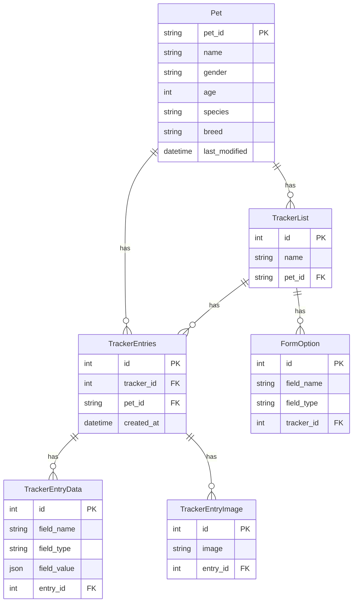

# Pet Treatment Tracker - Next.js Migration Plan

## Current Architecture Summary

Your Django project has the following core functionality:



---

## Recommended Tech Stack

| Layer | Technology | Rationale |

|-------|------------|-----------|

| Framework | **Next.js 14+ (App Router)** | Full-stack React framework, server components, API routes |

| Language | **TypeScript** | Type safety, better DX |

| Database ORM | **Prisma** | Similar to Django ORM, excellent TypeScript support |

| Database | **SQLite (dev) / PostgreSQL (prod)** | Easy local dev, production-ready option |

| Styling | **Tailwind CSS + shadcn/ui** | Modern, customizable component library |

| Forms | **React Hook Form + Zod** | Type-safe form validation |

| File Uploads | **Local storage (Next.js API route)** | Simple, keeps parity with Django media files |

| State Management | **React Query (TanStack Query)** | Server state caching and synchronization |

---

## Project Structure

```
pet-tracker-nextjs/
├── prisma/
│   └── schema.prisma          # Database models
├── src/
│   ├── app/
│   │   ├── layout.tsx         # Root layout
│   │   ├── page.tsx           # Home (Pet list)
│   │   ├── pets/
│   │   │   └── [petId]/
│   │   │       └── trackers/
│   │   │           ├── page.tsx           # Trackers list
│   │   │           └── new/page.tsx       # New tracker form
│   │   ├── trackers/
│   │   │   └── [trackerId]/
│   │   │       ├── entries/
│   │   │       │   ├── page.tsx           # Entries list
│   │   │       │   ├── new/page.tsx       # New entry form
│   │   │       │   └── [entryId]/edit/page.tsx
│   │   │       └── edit/page.tsx          # Edit tracker
│   │   └── api/
│   │       ├── pets/
│   │       │   ├── route.ts               # GET, POST
│   │       │   └── [petId]/route.ts       # GET, PATCH, DELETE
│   │       ├── trackers/
│   │       │   ├── route.ts
│   │       │   └── [trackerId]/route.ts
│   │       ├── entries/
│   │       │   ├── route.ts
│   │       │   └── [entryId]/route.ts
│   │       └── upload/route.ts            # Image upload endpoint
│   ├── components/
│   │   ├── ui/                # shadcn components
│   │   ├── pet-card.tsx
│   │   ├── pet-form-modal.tsx
│   │   ├── tracker-form.tsx
│   │   ├── entry-form.tsx
│   │   ├── dynamic-field.tsx  # Renders fields based on type
│   │   └── image-preview-modal.tsx
│   ├── lib/
│   │   ├── prisma.ts          # Prisma client singleton
│   │   ├── utils.ts           # Helper functions
│   │   └── validations.ts     # Zod schemas
│   └── types/
│       └── index.ts           # TypeScript interfaces
├── public/
│   └── uploads/               # Uploaded images
├── package.json
├── tailwind.config.ts
└── AGENTS.md                  # AI agent instructions
```

---

## Implementation Milestones

### Milestone 1: Project Setup and Database Schema

**Goal:** Initialize the Next.js project with all dependencies and define the Prisma schema matching your Django models.

**Deliverables:**

- Next.js 14 project with TypeScript
- Prisma configured with SQLite
- Database schema matching Django models
- shadcn/ui installed with base components

**Verification:**

- `npm run dev` starts without errors
- `npx prisma studio` shows empty tables matching the schema
- Base layout renders at `http://localhost:3000`

---

### Milestone 2: API Routes for Pets

**Goal:** Implement complete CRUD API for Pet entity.

**Endpoints:**

| Method | Endpoint | Description |

|--------|----------|-------------|

| GET | `/api/pets` | List all pets |

| POST | `/api/pets` | Create pet |

| GET | `/api/pets/[petId]` | Get single pet |

| PATCH | `/api/pets/[petId]` | Update pet |

| DELETE | `/api/pets/[petId]` | Delete pet |

**Verification:**

- Test all endpoints using curl or Postman
- Create, read, update, delete a pet successfully
- Verify data persists in database

---

### Milestone 3: Home Page UI (Pet Management)

**Goal:** Build the home page with pet list, add/edit/delete functionality with modals.

**Features:**

- Display pet grid/cards
- "Add New Pet" button opens modal form
- Edit button populates modal with existing data
- Delete button with confirmation
- All operations use the API routes

**Verification:**

- Add a new pet via modal, see it appear in the list
- Edit a pet, confirm changes persist
- Delete a pet, confirm removal

---

### Milestone 4: API Routes for Trackers

**Goal:** Implement CRUD API for TrackerList and FormOption.

**Endpoints:**

| Method | Endpoint | Description |

|--------|----------|-------------|

| GET | `/api/trackers?petId=X` | List trackers for a pet |

| POST | `/api/trackers` | Create tracker with options |

| GET | `/api/trackers/[trackerId]` | Get tracker with options |

| PATCH | `/api/trackers/[trackerId]` | Update tracker and options |

| DELETE | `/api/trackers/[trackerId]` | Delete tracker (cascades) |

**Verification:**

- Create a tracker with multiple field options
- Retrieve tracker, verify options included
- Update tracker name and modify options
- Delete tracker, verify cascade deletion

---

### Milestone 5: Tracker List and Forms UI

**Goal:** Build tracker management pages.

**Pages:**

- `/pets/[petId]/trackers` - List trackers for a pet
- `/pets/[petId]/trackers/new` - Create new tracker with dynamic field builder
- `/trackers/[trackerId]/edit` - Edit existing tracker

**Features:**

- Dynamic form builder (add/remove field options)
- Field type dropdown (Text, Date, Decimal, Integer, Image)
- Save via API, redirect on success

**Verification:**

- Create tracker with 3 different field types
- Edit tracker, add a new field, remove one
- Verify all changes persist

---

### Milestone 6: API Routes for Entries and Image Upload

**Goal:** Implement CRUD API for TrackerEntries, TrackerEntryData, and image upload.

**Endpoints:**

| Method | Endpoint | Description |

|--------|----------|-------------|

| GET | `/api/entries?trackerId=X` | List entries for tracker |

| POST | `/api/entries` | Create entry with data |

| GET | `/api/entries/[entryId]` | Get entry with data and images |

| PATCH | `/api/entries/[entryId]` | Update entry data |

| DELETE | `/api/entries/[entryId]` | Delete entry |

| POST | `/api/upload` | Upload image, return URL |

**Verification:**

- Create entry with multiple field values
- Upload image, verify file saved to `/public/uploads`
- Update entry, verify data changes
- Delete entry, verify cascade to entry data

---

### Milestone 7: Entry Management UI

**Goal:** Build entry list and form pages with dynamic field rendering.

**Pages:**

- `/trackers/[trackerId]/entries` - Entry table with edit/delete
- `/trackers/[trackerId]/entries/new` - Dynamic entry form
- `/trackers/[trackerId]/entries/[entryId]/edit` - Edit entry form

**Features:**

- Dynamic form fields based on tracker's FormOptions
- Image upload with preview
- Full-screen image modal on click
- Table display of entries with proper formatting

**Verification:**

- Create entry filling all dynamic fields including image
- View entry in table, click image for fullscreen
- Edit entry, change values, verify persistence
- Delete entry via table button

---

### Milestone 8: Polish and Deployment Prep

**Goal:** Final UI polish, error handling, and deployment configuration.

**Tasks:**

- Add loading states and error boundaries
- Implement toast notifications for actions
- Add responsive design for mobile
- Create production build configuration
- Add environment variable setup for deployment
- Write deployment documentation

**Verification:**

- Build completes without errors: `npm run build`
- All features work in production mode: `npm start`
- Mobile viewport displays correctly
- Error states display gracefully

---

## AGENTS.md Reference

An `AGENTS.md` file will be created in the new project root with detailed instructions for AI agents, including:

- Project context and tech stack
- Coding conventions (TypeScript strict mode, component patterns)
- API response format standards
- Prisma usage patterns
- Form handling patterns
- File structure requirements

---

## Key Technical Decisions

1. **Why Prisma over raw SQL or other ORMs?**

   - Native TypeScript types generated from schema
   - Similar model definition syntax to Django
   - Built-in migrations like Django's makemigrations/migrate

2. **Why shadcn/ui over other component libraries?**

   - Components are copied into your codebase (full control)
   - Built on Radix UI primitives (accessible)
   - Tailwind CSS native (consistent styling)

3. **Why local file upload over cloud storage?**

   - Matches your current Django approach
   - No external service dependencies
   - Can easily swap for S3/Cloudinary later if needed

4. **API Routes vs Server Actions?**

   - API routes maintain parity with your Django REST API approach
   - Easier to test independently
   - Can be consumed by mobile apps in the future